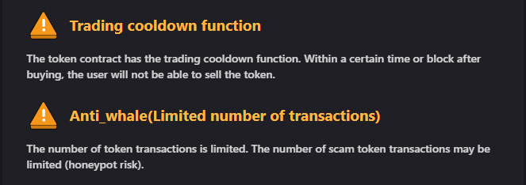

# Token security

Please use this link to verify FuYoH Token contract and make your own judgment.



YES. We have Trading Cooldown function to make sure no one will abuse with buy/sell of FYH token.

The purpose of Anti-Whale is rather straight forward, as mentioned many time before, we will take this project on a long term plan and we intent to protect it at all cost from massive purchasing and selling to manipulate the pricing.

## Anti-Whale

The Anti-Dump feature prevents holders from selling more than a pre-set amount of tokens within a single transaction.This discourages holders with a large number of tokens from having a substantial impact on the price, further stabilizing it.The **transaction limit** has been set at **0.1% of total supply**. The network will refuse any transaction selling an amount greater than the limit. As the price of the token fluctuates in the market, this may be altered. Any prospective changes will be announced in advance to the community.There is also a cool down time of 60 seconds on all sells. This will discourage dumping and avoiding the max transaction limit.
